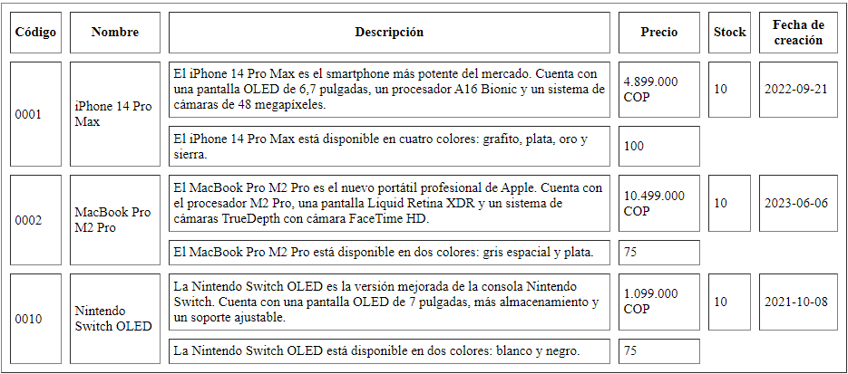

<!-- No borrar o modificar -->
[Inicio](./index.md)

## Sesión 4

<!-- Su documentación aquí -->

# Actividad: Crear una tabla HTML con información sobre productos.

Escribir una tabla HTML con 10 filas que muestre información sobre productos reales. La tabla debe tener las siguientes columnas:

* Código
* Nombre
* Descripción
* Precio
* Stock
* Fecha de creación

Además, combinar celdas en la tabla con los atributos rowspan y colspan, como se muestra en la siguiente imagen.

